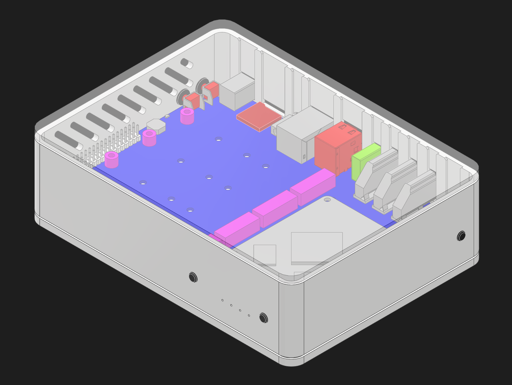
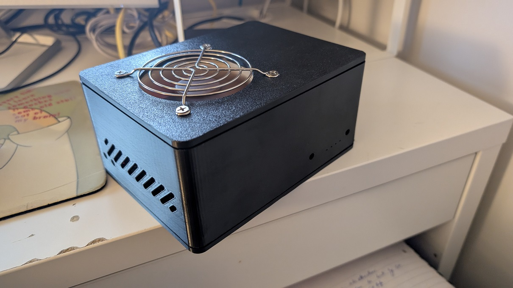

# CM3588 NAS Case
3D Printable Case for the CM3588 NAS board.  
Minimal Assembly required.  
Variants for Installations with fans are included.

If you have a fan, you can use [this code by vijaygill](https://github.com/vijaygill/pwm-fan-cm3588) to control the fans

### NOTE:
I do not have the NAS Board on Hand. If you decide to print the Case, please leave me some feedback to further improve the Case.  

The Case is [available for download](https://github.com/Nighthater/CM3588-NAS-Case/tree/master/STL).

## Required Components
- 4 M2 Threaded inserts
- 4 M2 Flat-Head Screws

Any Flat-Head screw is ok. Contersunk screws will damage the PCB, so avoid using these.  
The screw length must be smaller than 10mm.  

## Assembly

1. You need the three Parts of the Case and 5 buttons printed.
2. Begin by inserting the Threaded inserts in the 4 Standoff holes in the Main Body.
3. Place the 5 buttons inside the holes.
4. Insert the CM3588 Board into the Case. Keep it level when inserting. It should go in freely until it hits the standoffs.
5. Secure the PCB with the 4 Screws.
6. Attach the two Panels. The Panels are only using a friction fit currently. This might me improved in later revisions.
7. The NAS is ready to power up.

## Changes from the original repo
* Just added a taller version of the main body. Uses 80mm Noctua fan.

